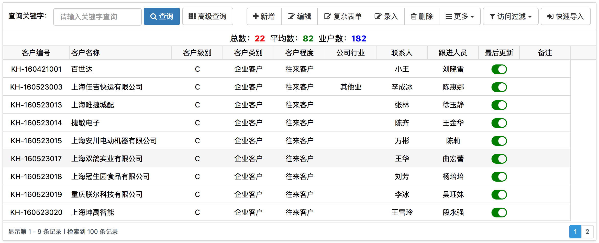

# JF表格控件



!> [示例](demo/jx-grid.html)

## 标记

使用类`jxgrid`标记

```html
 <div class="jxgrid" data-url="/user/getlist" data-head-data="[
    {label:'客户编号',name:'F_EnCode',width:130, align:'center',sort:true,statistics:true},
    {label:'客户名称',name:'F_FullName',width:200, align:'left',sort:true,statistics:true},
    {label:'客户级别',name:'F_CustLevelId',width:100, align:'center'},
    {label:'客户类别', name:'F_CustTypeId', width:100, align:'center'},
    {label:'客户程度', name:'F_CustDegreeId', width:100, align:'center'},
    {label:'公司行业', name:'F_CustIndustryId', width:100, align:'center'},
    {label:'联系人',name:'F_Contact',width:100, align:'center'},
    {label:'跟进人员', name:'F_TraceUserName', width:100, align:'center'},
    {label:'最后更新',name:'F_ModifyDate',width:80,align:'center',formatter: modifyDateFormatter},
    {label:'备注', name:'F_Description', width:100, align:'center'}]">
</div>
```

- 不分页

返回结构:
```
{
    success : true,      //数据是否加载成功
    msg : '数据加载成功',  //数据加载消息
    rows : []            //数据集合
}
```  

- 分页

请求参数:
```
{
    rows: 10,             // 每页行数
    page: 1,              // 当前页
    sidx: '',             // 排序列名称
    sord: '',             // 排序类型 asc/desc
}
```

返回结构:
```
{
    success : true,      //数据是否加载成功
    msg : '数据加载成功',  //数据加载消息
    rows : [],           //数据集合
    page : 1,            //当前页数
    total : 5,           //总页数
    records : 70         //总记录数
}
```  

- 树形结构


- 主子表


## 表格选项

### autuLoad - 自动加载数据(指定url的情况下才自动加载)
类型：Boolean，默认：true

### form - 查询表单对象
类型：jQuery，默认：false

### url - Json数据Url
类型：String，默认：''  

### rows - 每页行数
类型：Number，默认：10

### param - 请求参数
类型：Object，默认：{}

### rowdatas - 数据数组
类型：Array，默认：[]

### datatype - 数据类型
类型：String，默认：'array' 

### headData - 列数据
类型：Array，默认：[]

### isShowNum - 是否显示行号
类型：Boolean，默认：true

### isMultiselect - 是否允许多选
类型：Boolean，默认：false

### multiselectfield - 多选绑定字段
类型：String，默认：'' 

### isSubGrid - 是否有子表
类型：Boolean，默认：false

### subGridRowExpanded - 子表展开后调用函数
类型：Boolean，默认：false

### subGridHeight - 子表高度
类型：Number，默认：300

### onSelectRow - 选中一行后回调函数
类型：Function/Boolean，默认：false

### onRenderComplete - 表格加载完后调用
类型：Function/Boolean，默认：false

### isPage - 是否分页（目前只支持服务端分页）
类型：Boolean，默认：true

### pageparam - 请求参数
类型：Object

### sidx - 默认排序字段
类型：String，默认：''

### sord - 默认排序类型
类型：String，默认：''

### isTree - 是否树形显示（没有分页的情况下才支持） (只有在数据不多情况下才建议使用)
类型：Boolean，默认：false

### mainId - 关联的主键
类型：String，默认：'id'

### mainText - 关联的显示字段名称
类型：String，默认：'name'

### parentId - 树形关联字段
类型：String，默认：'parentId'

### reloadSelected - 刷新后是否还选择之前选中的,只支持单选
类型：Boolean，默认：false

### isAutoHeight - 自动适应表格高度
类型：Boolean，默认：false

### footerrow - 底部合计条
类型：Boolean，默认：false

### isEidt - 是否允许编辑
类型：Boolean，默认：false

### minheight - 最小高度
类型：Number，默认：0

### height - 高度
类型：Number，默认：0

### isStatistics - 统计条
类型：Boolean，默认：false

## 列选项

### label - 列标题
类型：String，默认：''

### name - 列字段名
类型：String，默认：''

### align - 列对齐方式
类型：String，默认：'left'

可选值包括:`left`、`center`、`right`

### width - 宽度
类型：Number，默认：0

### sort - 是否启用列排序
类型：Boolean，默认：false

### frozen - 是否启用列冻结
类型：Boolean，默认：false

### statistics - 是否启用列统计
类型：Boolean，默认：false
需要设置属性`footerrow`、`isStatistics`为`true`

### formatter(value, row, dfop, $dcell) - 列值格式化
类型：function，默认：null

## 方法

### reload(params) - 刷新数据
- params 提交给后台参数
 
### empty() - 清除所有行

### removeSelectedRow() - 移除选中行

### selectRows(values, separator) - 选中行  
- values {String}  主键数组字符串
- separator {String} 分割符
             
### getRowCount() - 获取总行数
        
### getSelectedIds() - 获取选中的主键数组
            
### getSelectedRows() - 获取选中的行数组
            
### getSelectedRow() - 获取选中的行对象(只取第一个选中行)
            
### getRowById(id) - 获取指定主键的行对象
- id {String} 主键
            
### getRows() - 获取所有数据行
           
### getOptions() -  获取表格配置
          
### getSelectedOrCheckedData(separator) - 获取选中或者复选行的值
- separator {String} 分隔符
         
### scrollToSelectedOrCheckedNode() - 滚动到选中节点或者复选节点

### clearSelectedOrChecked() - 清除节点选中节点或者复选框
              
