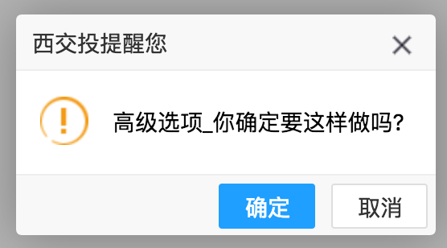
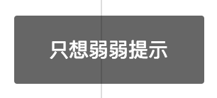
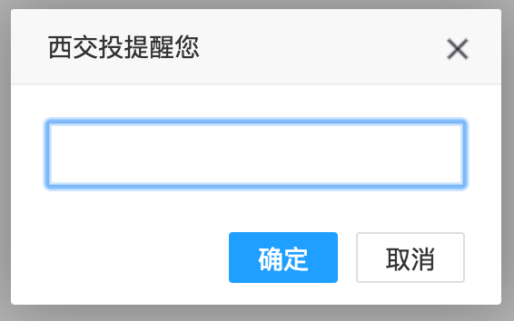

# 对话框

对话框控件集成封装了[`layer`](https://github.com/sentsin/layer/)插件。

!> [对话框控件演示](../demo/docs/jx-dialog.html)

## JavaScript方式调用

使用方法:下面这些对话框函数全部扩展到核心对象`jx`中,使用`jx.alert/confirm/msg/prompt`方式调用.

### alert(msg, [callback])
警告框
-  msg {string} 消息内容或者配置选项
-  callback {function} 回调函数,非必须

```js
//简单警告框
jx.alert('只想简单的提示'); 

//带回调函数的警告框
jx.alert('带回调函数警告框', function(index){
    alert('回调函数执行');
    jx.closeDialog(index);//需进行手工关闭
});

//使用自定义配置的警告框
jx.alert({
    title: '西交投提醒您',
    time: 3000,//3000毫秒后自动关闭
    content:'自定义选项的警告框',//消息内容
    end:function() { //对话框销毁后触发的回调
        alert('对话框销毁了');
    },
    yes: function(index) { //点击确定按钮后的回调函数
        alert('回调函数执行');
        jx.closeDialog(index); //如果设定了yes回调，需进行手工关闭
    }
});
```


### confirm(msg, [callback]) 
确认框
-  msg {string} 消息内容或者配置选项
-  callback {function} 回调函数,非必须

```js
//简单确认框
jx.confirm('你确定要这样做吗?',function (ok,index){
    if (ok){ //点击确认按钮
        alert('你太残忍了');
    }
    else { //点击取消按钮
        alert('你还算有人性');
    }
}); 

//使用自定义配置的警告框
jx.confirm({
    title: "西交投提醒您",
    content:'高级选项_你确定要这样做吗?',//消息内容
    icon: 7,
    btn: ['确定', '取消'],
    yes : function (index) {
        alert('你太残忍了');
        jx.closeDialog(index); //如果设定了yes回调，需进行手工关闭
    },
    btn2 : function (index) {
        alert('你还算有人性');
    }
});
```

 
### msg(msg, icon, [callback])
信息框,默认4秒后自动消失.
-  msg {string} 消息内容或者配置选项
-  icon {number} 图标或者回调函数
-  callback {function} 回调函数,非必须

```js
//简单提示
jx.msg('只想弱弱提示');
//指定图标
jx.msg('有表情地提示', 6);
//指定回调函数
jx.msg('关闭后想做些什么', function(){
    alert('被关闭了');
}); 
//指定配置选项
jx.msg({
    time: 3000,//3000毫秒后自动关闭
    content:'自定义选项的提示',//消息内容
    end:function() { //对话框销毁后触发的回调
        alert('信息框销毁了');
    }
})
```

    
### prompt(options, [callback])
输入框
- options {object} 选项
- callback {function} 回调函数,非必须

输入框专用属性
```js
//prompt层新定制的成员如下
{
  formType: 1,      //输入框类型，支持0（文本）默认1（密码）2（多行文本）
  value: '',        //初始时的值，默认空字符
  maxlength: 140    //可输入文本的最大长度，默认500
}
```
```js
//简单调用
jx.prompt(function(value, index, elem){
  alert(value); //得到value
  jx.closeDialog(index);
});
 
//指定配置选项
jx.prompt({
  title:'西交投提醒您',
  formType: 0,
  value: '初始值'
}, function(value, index, elem){
  alert(value); //得到value
  jx.closeDialog(index);
});
```

        
### closeDialog(index)
关闭对话框
- index {number} 对话框索引

### closeAllDialog
关闭所有对话框

### dialog(options)
打开窗口
- options {object} 选项

```js
//dialog层新定制的成员如下
{
  maskMsg:'正在加载...'                           // 加载消息提示
  url: '',                                      // iframe加载地址
  params: {},                                   // url参数对象
  width: '50%'                                  // 对话框宽度:100px或者80%;
  height: '50%'                                 // 对话框高度:100px或者80%;
  btnFont: ['fa fa-save', 'fa fa-sign-in']      // 指定按钮的图标字体样式
  callback: function (dwin, layero, index){}    // 确定按钮的回调函数,return true 关闭对话框
}
```
```js
jx.dialog({
   title:'对话框页面',
   url: '../demo/index.html', 
   width: '80%',
   height: '80%',
   btn:'确定',
   btnFont:'fa fa-check',
   callback:function(dwin, layero, index) {
       // dwin iframe 页面对应的window对象
       // layero iframe 页面对应jQuery对象
       // index 对话框索引号
       alert('确定');
       jx.closeDialog(index);
   }
});
```

## 组件方式调用

在页面元素中标记`jxdialog`类,组件自动绑定`click`事件,点击后显示对话框

```html
<a class="btn btn-default jxdialog"
   data-options="{title: '创建文章',url: 'page/winedit.html',closeBtn: 0,
                   width:'60%',height:'50%',resize:true,btn: ['保存', '关闭']}"
   > 对话框
</a>

<!--或者同时使用下面的方式设置选项-->
<script>
jx.ready(function () {
    $('a').jxoptions({
        title: '创建文章',
        url: 'page/winedit.html',
        closeBtn: 0,
        width:'60%',
        height:'50%',
        resize:true,
        btn: ['保存', '关闭']
    });
});
</script>
```

## 组件对话框选项

与[dialog(options)](#dialogoptions)选项一致

## 组件对话框方法

使用方法:
```js
$('a').jxdialog('show');
$('a').jxdialog('close');
```

### show()
显示对话框

### close()
关闭对话框

## 组件对话框事件

使用方法:
```js
$('a').on('beforeshow',function() {
  //事件代码
});
```

### beforeshow
在对话框显示之前触发,`return false`阻止对话框显示.

### aftershow
在对话框显示成功之后触发.相当于`success`回调函数.

### beforeclose
在对话框关闭之前触发.相当于`cancel`回调函数.

### afterclose
在对话框关闭之后触发.相当于`end`回调函数.

## layer原生选项

!> 如果想要在最顶层页面中使用此对话框,需要在前面添加`top`

```js
top.layer.open(ops);
```

### type - 基本层类型

类型：Number，默认：0

layer提供了5种层类型。可传入的值有：`0`（信息框，默认）`1`（页面层）`2`（iframe层）`3`（加载层）`4`（tips层）。 若你采用`layer.open({type: 1})`方式调用，则type为必填项（信息框除外）

### title - 标题

类型：String/Array/Boolean，默认：'信息'

title支持三种类型的值，若你传入的是普通的字符串，如*title :'我是标题'*，那么只会改变标题文本；若你还需要自定义标题区域样式，那么你可以*title: ['文本', 'font-size:18px;']*，数组第二项可以写任意css样式；如果你不想显示标题栏，你可以*title: false*

### content - 内容

类型：String/DOM/Array，默认：''

content可传入的值是灵活多变的，不仅可以传入普通的html内容，还可以指定DOM，更可以随着type的不同而不同。譬如：

```js
/*
 如果是页面层
 */
layer.open({
  type: 1, 
  content: '传入任意的文本或html' //这里content是一个普通的String
});
layer.open({
  type: 1,
  content: $('#id') //这里content是一个DOM，注意：最好该元素要存放在body最外层，否则可能被其它的相对元素所影响
});
//Ajax获取
$.post('url', {}, function(str){
  layer.open({
    type: 1,
    content: str //注意，如果str是object，那么需要字符拼接。
  });
});
/*
 如果是iframe层
 */
layer.open({
  type: 2, 
  content: 'http://sentsin.com' //这里content是一个URL，如果你不想让iframe出现滚动条，你还可以content: ['http://sentsin.com', 'no']
}); 
/*
 如果是用layer.open执行tips层
 */
layer.open({
  type: 4,
  content: ['内容', '#id'] //数组第二项即吸附元素选择器或者DOM
});      
```

### skin - 样式类名

类型：String，默认：''

skin不仅允许你传入layer内置的样式class名，还可以传入您自定义的class名。这是一个很好的切入点，意味着你可以借助skin轻松完成不同的风格定制。目前layer内置的skin有：*layui-layer-lan**layui-layer-molv*，未来我们还会选择性地内置更多，但更推荐您自己来定义。以下是一个自定义风格的简单例子

```js
//单个使用
layer.open({
  skin: 'demo-class'
});
//全局使用。即所有弹出层都默认采用，但是单个配置skin的优先级更高
layer.config({
  skin: 'demo-class'
})
//CSS 
body .demo-class .layui-layer-title{background:#c00; color:#fff; border: none;}
body .demo-class .layui-layer-btn{border-top:1px solid #E9E7E7}
body .demo-class .layui-layer-btn a{background:#333;}
body .demo-class .layui-layer-btn .layui-layer-btn1{background:#999;}
//…
//加上body是为了保证优先级。你可以借助Chrome调试工具，定义更多样式控制层更多的区域。   
```

你也可以[去查看layer皮肤制作说明](http://layer.layui.com/skin.html#publish)

### area - 宽高

类型：String/Array，默认：'auto'

在默认状态下，layer是宽高都自适应的，但当你只想定义宽度时，你可以*area: '500px'*，高度仍然是自适应的。当你宽高都要定义时，你可以*area: ['500px', '300px']*

### offset - 坐标

类型：String/Array，默认：垂直水平居中

offset默认情况下不用设置。但如果你不想垂直水平居中，你还可以进行以下赋值：

| 值                         | 备注              |
| ------------------------- | --------------- |
| offset: 'auto'            | 默认坐标，即垂直水平居中    |
| offset: '100px'           | 只定义top坐标，水平保持居中 |
| offset: ['100px', '50px'] | 同时定义top、left坐标  |
| offset: 't'               | 快捷设置顶部坐标        |
| offset: 'r'               | 快捷设置右边缘坐标       |
| offset: 'b'               | 快捷设置底部坐标        |
| offset: 'l'               | 快捷设置左边缘坐标       |
| offset: 'lt'              | 快捷设置左上角         |
| offset: 'lb'              | 快捷设置左下角         |
| offset: 'rt'              | 快捷设置右上角         |
| offset: 'rb'              | 快捷设置右下角         |

### icon - 图标。信息框和加载层的私有参数

类型：Number，默认：-1（信息框）/0（加载层）

信息框默认不显示图标。当你想显示图标时，默认皮肤可以传入*0-6*如果是加载层，可以传入*0-2*。如：

```js
//eg1
layer.alert('酷毙了', {icon: 1});
//eg2
layer.msg('不开心。。', {icon: 5});
//eg3
layer.load(1); //风格1的加载       
```

### btn - 按钮

类型：String/Array，默认：'确认'

信息框模式时，btn默认是一个确认按钮，其它层类型则默认不显示，加载层和tips层则无效。当您只想自定义一个按钮时，你可以*btn: '我知道了'*，当你要定义两个按钮时，你可以*btn: ['yes', 'no']*。当然，你也可以定义更多按钮，比如：*btn: ['按钮1', '按钮2', '按钮3', …]*，按钮1的回调是yes，而从按钮2开始，则回调为btn2: function(){}，以此类推。如：

```js
//eg1       
layer.confirm('纳尼？', {
  btn: ['按钮一', '按钮二', '按钮三'] //可以无限个按钮
  ,btn3: function(index, layero){
    //按钮【按钮三】的回调
  }
}, function(index, layero){
  //按钮【按钮一】的回调
}, function(index){
  //按钮【按钮二】的回调
});
 
//eg2
layer.open({
  content: 'test'
  ,btn: ['按钮一', '按钮二', '按钮三']
  ,yes: function(index, layero){
    //按钮【按钮一】的回调
  }
  ,btn2: function(index, layero){
    //按钮【按钮二】的回调
    
    //return false 开启该代码可禁止点击该按钮关闭
  }
  ,btn3: function(index, layero){
    //按钮【按钮三】的回调
    
    //return false 开启该代码可禁止点击该按钮关闭
  }
  ,cancel: function(){ 
    //右上角关闭回调
    
    //return false 开启该代码可禁止点击该按钮关闭
  }
});
```

### btnAlign - 按钮排列

类型：String，默认：r

你可以快捷定义按钮的排列位置，btnAlign的默认值为r，即右对齐。该参数可支持的赋值如下：

| 值             | 备注             |
| ------------- | -------------- |
| btnAlign: 'l' | 按钮左对齐          |
| btnAlign: 'c' | 按钮居中对齐         |
| btnAlign: 'r' | 按钮右对齐。默认值，不用设置 |  

### closeBtn - 关闭按钮

类型：String/Boolean，默认：1

layer提供了两种风格的关闭按钮，可通过配置*1*和*2*来展示，如果不显示，则*closeBtn: 0*

### shade - 遮罩

类型：String/Array/Boolean，默认：0.3

即弹层外区域。默认是0.3透明度的黑色背景（'#000'）。如果你想定义别的颜色，可以*shade: [0.8, '#393D49']*；如果你不想显示遮罩，可以*shade: 0*

### shadeClose - 是否点击遮罩关闭

类型：Boolean，默认：false

如果你的shade是存在的，那么你可以设定shadeClose来控制点击弹层外区域关闭。

### time - 自动关闭所需毫秒

类型：Number，默认：0

默认不会自动关闭。当你想自动关闭时，可以*time: 5000*，即代表5秒后自动关闭，注意单位是毫秒（1秒=1000毫秒）

### id - 用于控制弹层唯一标识

类型：String，默认：空字符

设置该值后，不管是什么类型的层，都只允许同时弹出一个。一般用于页面层和iframe层模式

### anim - 弹出动画

类型：Number，默认：0

我们的出场动画全部采用CSS3。这意味着除了ie6-9，其它所有浏览器都是支持的。目前anim可支持的动画类型有*0-6* 如果不想显示动画，设置 anim: -1 即可。另外需要注意的是，3.0之前的版本用的是 *shift* 参数

| 值       | 备注       |
| ------- | -------- |
| anim: 0 | 平滑放大。默认  |
| anim: 1 | 从上掉落     |
| anim: 2 | 从最底部往上滑入 |
| anim: 3 | 从左滑入     |
| anim: 4 | 从左翻滚     |
| anim: 5 | 渐显       |
| anim: 6 | 抖动       |

### isOutAnim - 关闭动画 （layer 3.0.3新增）

类型：Boolean，默认：true

默认情况下，关闭层时会有一个过度动画。如果你不想开启，设置 isOutAnim: false 即可

### maxmin - 最大最小化。

类型：Boolean，默认：false

该参数值对*type:1*和*type:2*有效。默认不显示最大小化按钮。需要显示配置*maxmin: true*即可

### fixed - 固定

类型：Boolean，默认：true

即鼠标滚动时，层是否固定在可视区域。如果不想，设置*fixed: false*即可

### resize - 是否允许拉伸

类型：Boolean，默认：true

默认情况下，你可以在弹层右下角拖动来拉伸尺寸。如果对指定的弹层屏蔽该功能，设置 false即可。该参数对loading、tips层无效

### resizing - 监听窗口拉伸动作

类型：Function，默认：null

当你拖拽弹层右下角对窗体进行尺寸调整时，如果你设定了该回调，则会执行。回调返回一个参数：当前层的DOM对象

```js
resizing: function(layero){
  console.log(layero);
}             
```

### scrollbar - 是否允许浏览器出现滚动条

类型：Boolean，默认：true

默认允许浏览器滚动，如果设定*scrollbar: false*，则屏蔽

### maxWidth - 最大宽度

类型：Number，默认：360

请注意：只有当*area: 'auto'*时，maxWidth的设定才有效。

### maxHeight - 最大高度

类型：Number，默认：无

请注意：只有当高度自适应时，maxHeight的设定才有效。

### zIndex - 层叠顺序

类型：，默认：19891014（贤心生日 0.0）

一般用于解决和其它组件的层叠冲突。

### move - 触发拖动的元素

类型：String/DOM/Boolean，默认：'.layui-layer-title'

默认是触发标题区域拖拽。如果你想单独定义，指向元素的选择器或者DOM即可。如*move: '.mine-move'*。你还配置设定*move: false*来禁止拖拽

[moveOut - 是否允许拖拽到窗口外

类型：Boolean，默认：false

默认只能在窗口内拖拽，如果你想让拖到窗外，那么设定*moveOut: true*即可

### moveEnd - 拖动完毕后的回调方法

类型：Function，默认：null

默认不会触发moveEnd，如果你需要，设定*moveEnd: function(layero){}*即可。其中layero为当前层的DOM对象

### tips - tips方向和颜色

类型：Number/Array，默认：2

tips层的私有参数。支持*上**右**下**左*四个方向，通过*1-4*进行方向设定。如*tips: 3*则表示在元素的下面出现。有时你还可能会定义一些颜色，可以设定*tips: [1, '#c00']*

### tipsMore - 是否允许多个tips

类型：Boolean，默认：false

允许多个意味着不会销毁之前的tips层。通过*tipsMore: true*开启

### success - 层弹出后的成功回调方法

类型：Function，默认：null

当你需要在层创建完毕时即执行一些语句，可以通过该回调。success会携带两个参数，分别是*当前层DOM**当前层索引*。如：

```js
layer.open({
  content: '测试回调',
  success: function(layero, index){
    console.log(layero, index);
  }
});              
```

### yes - 确定按钮回调方法

类型：Function，默认：null

该回调携带两个参数，分别为当前层索引、当前层DOM对象。如：

```js
layer.open({
  content: '测试回调',
  yes: function(index, layero){
    //do something
    layer.close(index); //如果设定了yes回调，需进行手工关闭
  }
});        
```

### cancel - 右上角关闭按钮触发的回调

类型：Function，默认：null

该回调携带两个参数，分别为：当前层索引参数（index）、当前层的DOM对象（layero），默认会自动触发关闭。如果不想关闭，*return false*即可，如；

```js
cancel: function(index, layero){ 
  if(confirm('确定要关闭么')){ //只有当点击confirm框的确定时，该层才会关闭
    layer.close(index)
  }
  return false; 
}    
```

### end - 层销毁后触发的回调

类型：Function，默认：null

无论是确认还是取消，只要层被销毁了，end都会执行，不携带任何参数。

### full/min/restore -分别代表最大化、最小化、还原 后触发的回调

类型：Function，默认：null

携带一个参数，即当前层DOM

## layer原生方法

### layer.config(options) - 初始化全局配置

这是一个可以重要也可以不重要的方法，重要的是，它的权利真的很大，尤其是在模块化加载layer时，你会发现你必须要用到它。它不仅可以配置一些诸如路径、加载的模块，甚至还可以决定整个弹层的默认参数。而说它不重要，是因为多数情况下，你会发现，你似乎不是那么十分需要它。但你真的需要认识一下这位伙计。

如果您是采用*seajs*或者*requirejs*加载layer，你需要执行该方法来完成初始化的配置。比如：

```js
layer.config({
  path: '/res/layer/' //layer.js所在的目录，可以是绝对目录，也可以是相对目录
});
//这样的话，layer就会去加载一些它所需要的配件，比如css等。  
//当然，你即便不用seajs或者requirejs，也可以通过上述方式设定路径   
```

如果你是采用`<script src="?a.js&layer.js">`这种合并的方式引入layer，那么您需要在script标签上加一个自定义属性merge="true"。如：

```
<script src="?a.js&layer.js" merge="true">
//这样的话，layer就不会去自动去获取路径，但你需要通过以下方式来完成初始化的配置
layer.config({
  path: '/res/layer/' //layer.js所在的目录，可以是绝对目录，也可以是相对目录
});
```

注意：*如果采用 layui 加载 layer，无需设置 path。所以前置工作都是自动完成。*

但layer.config的作用远不止上述这样。它还可以配置层*默认的基础参数*，如：

```js
layer.config({
  anim: 1, //默认动画风格
  skin: 'layui-layer-molv' //默认皮肤
  …
});
//除此之外，extend还允许你加载拓展的css皮肤，如：
layer.config({
  //如果是独立版的layer，则将myskin存放在./skin目录下
  //如果是layui中使用layer，则将myskin存放在./css/modules/layer目录下
  extend: 'myskin/style.css'
});
//具体的皮肤定制，可以参见：skin参数说明      
```

### layer.ready(callback) - 初始化就绪

由于我们的layer内置了轻量级加载器，所以你根本不需要单独引入css等文件。但是加载总是需要过程的。当你在页面一打开就要执行弹层时，你最好是将弹层放入ready方法中，如：

```js
//页面一打开就执行弹层
layer.ready(function(){
  layer.msg('很高兴一开场就见到你');
});      
```

我是华丽的酱油：介绍完上面两位引导者，接下来我们真正的主角闪亮登场了。此处应有掌声 ^,^

### layer.open(options) - 原始核心方法

基本上是露脸率最高的方法，不管是使用哪种方式创建层，都是走*layer.open()*，创建任何类型的弹层都会返回一个当前层索引，上述的*options即是基础参数*，另外，该文档*统一采用options作为基础参数的标识*例子：

```js
var index = layer.open({
  content: 'test'
});
//拿到的index是一个重要的凭据，它是诸如layer.close(index)等方法的必传参数。       
```

噢，请等等，上面这位主角的介绍篇幅怎么看怎么都觉得跟它的地位不符，作者在文档中只给了它如此可怜的一块地？？这是因为，它真的已经大众得不能再大众了，你真正需要了解的，是它的内部器官，即上面一大篇幅介绍的各种基础参数。 ←_←

### layer.alert(content, options, yes) - 普通信息框

它的弹出似乎显得有些高调，一般用于对用户造成比较强烈的关注，类似系统alert，但却比alert更灵便。它的参数是自动向左补齐的。通过第二个参数，可以设定各种你所需要的基础参数，但如果你不需要的话，直接写回调即可。如

```js
//eg1
layer.alert('只想简单的提示');        
//eg2
layer.alert('加了个图标', {icon: 1}); //这时如果你也还想执行yes回调，可以放在第三个参数中。
//eg3
layer.alert('有了回调', function(index){
  //do something
  
  layer.close(index);
});   
```

### layer.confirm(content, options, yes, cancel) - 询问框

类似系统confirm，但却远胜confirm，另外它*不是和系统的confirm一样阻塞*你需要把交互的语句放在回调体中。同样的，它的参数也是自动补齐的。

```js
//eg1
layer.confirm('is not?', {icon: 3, title:'提示'}, function(index){
  //do something
  
  layer.close(index);
});
//eg2
layer.confirm('is not?', function(index){
  //do something
  
  layer.close(index);
});       
```

### layer.msg(content, options, end) - 提示框

我们在源码中用了相对较大的篇幅来定制了这个msg，目的是想将其打造成露脸率最高的提示框。而事实上我的确也在大量地使用它。因为它简单，而且足够得自觉，它不仅占据很少的面积，而且默认还会3秒后*自动消失*所有这一切都决定了我对msg的爱。因此*我赋予了它许多可能*在外形方面，它坚持简陋的变化，在作用方面，它坚持零用户操作。而且它的参数也是自动补齐的。

```js
//eg1
layer.msg('只想弱弱提示');
//eg2
layer.msg('有表情地提示', {icon: 6}); 
//eg3
layer.msg('关闭后想做些什么', function(){
  //do something
}); 
//eg
layer.msg('同上', {
  icon: 1,
  time: 2000 //2秒关闭（如果不配置，默认是3秒）
}, function(){
  //do something
});   
```

### layer.load(icon, options) - 加载层

type:3的深度定制。load并不需要你传太多的参数，但如果你不喜欢默认的加载风格，你还有选择空间。icon支持传入*0-2*如果是0，无需传。另外特别注意一点：*load默认是不会自动关闭的*，因为你一般会在ajax回调体中关闭它。

```js
//eg1
var index = layer.load();
//eg2
var index = layer.load(1); //换了种风格
//eg3
var index = layer.load(2, {time: 10*1000}); //又换了种风格，并且设定最长等待10秒 
//关闭
layer.close(index);
```

### layer.tips(content, follow, options) - tips层

type:4的深度定制。也是我本人比较喜欢的一个层类型，因为它拥有和msg一样的低调和自觉，而且会*智能定位*，即灵活地判断它应该出现在哪边。默认是在元素右边弹出

```js
//eg1
layer.tips('只想提示地精准些', '#id');
//eg 2
$('#id').on('click', function(){
  var that = this;
  layer.tips('只想提示地精准些', that); //在元素的事件回调体中，follow直接赋予this即可
});
//eg 3
layer.tips('在上面', '#id', {
  tips: 1
});
```

上面主要是一些弹层的调用方式，而下面介绍的是一些辅助性的方法

### layer.close(index) - 关闭特定层

关于它似乎没有太多介绍的必要，唯一让你疑惑的，可能就是这个*index*了吧。事实上它非常容易得到。

```js
//当你想关闭当前页的某个层时
var index = layer.open();
var index = layer.alert();
var index = layer.load();
var index = layer.tips();
//正如你看到的，每一种弹层调用方式，都会返回一个index
layer.close(index); //此时你只需要把获得的index，轻轻地赋予layer.close即可
 
//如果你想关闭最新弹出的层，直接获取layer.index即可
layer.close(layer.index); //它获取的始终是最新弹出的某个层，值是由layer内部动态递增计算的
 
//当你在iframe页面关闭自身时
var index = parent.layer.getFrameIndex(window.name); //先得到当前iframe层的索引
parent.layer.close(index); //再执行关闭  
```

### layer.closeAll(type) - 关闭所有层

如果你很懒，你*不想去获取index*你只想关闭。那么closeAll真的可以帮上你。如果你不指向层类型的话，它会销毁掉当前页所有的layer层。当然，如果你只想关闭某个类型的层，那么你可以

```js
layer.closeAll(); //疯狂模式，关闭所有层
layer.closeAll('dialog'); //关闭信息框
layer.closeAll('page'); //关闭所有页面层
layer.closeAll('iframe'); //关闭所有的iframe层
layer.closeAll('loading'); //关闭加载层
layer.closeAll('tips'); //关闭所有的tips层 
```

### layer.style(index, cssStyle) - 重新定义层的样式

该方法对loading层和tips层无效。参数index为层的索引，cssStyle允许你传入任意的css属性

```js
//重新给指定层设定width、top等
layer.style(index, {
  width: '1000px',
  top: '10px'
});                  
```

### layer.title(title, index) - 改变层的标题

使用方式：*layer.title('标题变了', index)*

### layer.getChildFrame(selector, index) - 获取iframe页的DOM

当你试图在当前页获取iframe页的DOM元素时，你可以用此方法。*selector即iframe页的选择器*

```js
layer.open({
  type: 2,
  content: 'test/iframe.html',
  success: function(layero, index){
    var body = layer.getChildFrame('body', index);
    var iframeWin = window[layero.find('iframe')[0]['name']]; //得到iframe页的窗口对象，执行iframe页的方法：iframeWin.method();
    console.log(body.html()) //得到iframe页的body内容
    body.find('input').val('Hi，我是从父页来的')
  }
});      
```

### layer.getFrameIndex(windowName) - 获取特定iframe层的索引

此方法一般用于在iframe页关闭自身时用到。

```js
//假设这是iframe页
var index = parent.layer.getFrameIndex(window.name); //先得到当前iframe层的索引
parent.layer.close(index); //再执行关闭    
```

### layer.iframeAuto(index) - 指定iframe层自适应

调用该方法时，iframe层的高度会重新进行适应

### layer.iframeSrc(index, url) - //重置特定iframe url

似乎不怎么常用的样子。使用方式：*layer.iframeSrc(index, 'http://sentsin.com')*

### layer.setTop(layero) -置顶当前窗口

非常强大的一个方法，虽然一般很少用。但是当你的页面有很多很多layer窗口，你需要像Window窗体那样，点击某个窗口，该窗体就置顶在上面，那么setTop可以来轻松实现。它采用巧妙的逻辑，以使这种置顶的性能达到最优

```js
//通过这种方式弹出的层，每当它被选择，就会置顶。
layer.open({
  type: 2,
  shade: false,
  area: '500px',
  maxmin: true,
  content: 'http://www.layui.com',
  zIndex: layer.zIndex, //重点1
  success: function(layero){
    layer.setTop(layero); //重点2
  }
});
```

### layer.full()、layer.min()、layer.restore() - 手工执行最大小化

> 请注意，从2.3开始，无需通过layer.config来加载拓展模块。如果您是之前版本，则需通过下述方式来加载

```js
layer.config({
  extend: 'extend/layer.ext.js'
});       
```

### layer.prompt(options, yes) - 输入层

prompt的参数也是向前补齐的。options不仅可支持传入基础参数，还可以传入prompt专用的属性。当然，也可以不传。yes携带*value 表单值**index 索引**elem 表单元素*

```js
//prompt层新定制的成员如下
{
  formType: 1, //输入框类型，支持0（文本）默认1（密码）2（多行文本）
  value: '', //初始时的值，默认空字符
  maxlength: 140, //可输入文本的最大长度，默认500
}
 
//例子1
layer.prompt(function(value, index, elem){
  alert(value); //得到value
  layer.close(index);
});
 
//例子2
layer.prompt({
  formType: 2,
  value: '初始值',
  title: '请输入值',
  area: ['800px', '350px'] //自定义文本域宽高
}, function(value, index, elem){
  alert(value); //得到value
  layer.close(index);
});
```

### layer.tab(options) - tab层

tab层只单独定制了一个成员，即*tab: []*，这个好像没有什么可介绍的，简单粗暴看例子

```js
layer.tab({
  area: ['600px', '300px'],
  tab: [{
    title: 'TAB1', 
    content: '内容1'
  }, {
    title: 'TAB2', 
    content: '内容2'
  }, {
    title: 'TAB3', 
    content: '内容3'
  }]
});    
```

### layer.photos(options) - 相册层

相册层，也可以称之为图片查看器。它的出场动画从layer内置的动画类型中随机展现。photos支持传入json和直接读取页面图片两种方式。如果是json传入，如下：

```js
$.getJSON('/jquery/layer/test/photos.json', function(json){
  layer.photos({
    photos: json
    ,anim: 5 //0-6的选择，指定弹出图片动画类型，默认随机（请注意，3.0之前的版本用shift参数）
  });
}); 
//而返回的json需严格按照如下格式：
{
  "title": "", //相册标题
  "id": 123, //相册id
  "start": 0, //初始显示的图片序号，默认0
  "data": [   //相册包含的图片，数组格式
    {
      "alt": "图片名",
      "pid": 666, //图片id
      "src": "", //原图地址
      "thumb": "" //缩略图地址
    }
  ]
}
```      

如果是直接从页面中获取图片，那么需要指向图片的父容器，并且你的img可以设定一些规定的属性（但不是必须的）。

```html
//HTML示例
<div id="layer-photos-demo" class="layer-photos-demo">
  
  
</div>
 
<script>
//调用示例
layer.photos({
  photos: '#layer-photos-demo'
  ,anim: 5 //0-6的选择，指定弹出图片动画类型，默认随机（请注意，3.0之前的版本用shift参数）
}); 
</script>
```

第二种方式的图片查看器显然更加简单，因为无需像第一种那样返回规定的json，但是他们还是有各自的应用场景的，你可以按照你的需求进行选择。另外，photos还有个tab回调，切换图片时触发。

```js
layer.photos({
  photos: json/选择器,
  tab: function(pic, layero){
    console.log(pic) //当前图片的一些信息
  }
}); 
```


