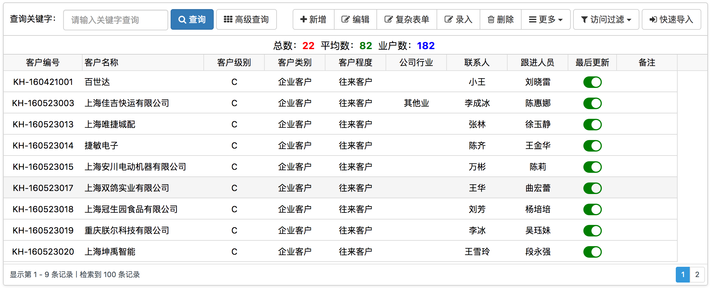

# 表格控件



!> [表格控件演示](../demo/docs/jx-grid.html)

## 使用方法

使用类`jxgrid`标记

```html
<div class="jxlayout">
    <div class="jxlayout-wrap">
        <div class="jxlayout-tool">
            <form class="jxlayout-form form-inline">
                <div class="form-group">
                    <label>查询关键字：</label>
                    <input class="form-control" placeholder="请输入关键字查询">
                </div>
                <button class="btn btn-primary ml-5px" type="submit">
                    <i class="fa fa-search"></i> 查询
                </button>
                <div class="pull-right">
                    <div class="btn-group">
                        <a class="btn btn-default">
                            <i class="fa fa-plus"></i> 新增
                        </a>
                    </div>
                </div>
            </form>
        </div>
        <div class="jxlayout-body jxgrid"
             data-url="../../api/grid.json"
             data-head-data="[
                {label:'客户编号',name:'F_EnCode',width:130, align:'center',sort:true,statistics:true},
                {label:'客户名称',name:'F_FullName',width:200, align:'left',sort:true,statistics:true},
                {label:'客户级别',name:'F_CustLevelId',width:100, align:'center'},
                {label:'客户类别', name:'F_CustTypeId', width:100, align:'center'},
                {label:'客户程度', name:'F_CustDegreeId', width:100, align:'center'},
                {label:'公司行业', name:'F_CustIndustryId', width:100, align:'center'},
                {label:'联系人',name:'F_Contact',width:100, align:'center'},
                {label:'跟进人员', name:'F_TraceUserName', width:100, align:'center'},
                {label:'最后更新',name:'F_ModifyDate',width:80,align:'center',formatter: modifyDateFormatter},
                {label:'备注', name:'F_Description', width:100, align:'center'}
             ]"></div>
    </div>
</div>
```

## 表格选项

### url - Json数据Url
类型：String，默认：''

返回结构:
```js
{
    code : 200,
    data : {
           rows: [],        // 数据数组
           total: 2,        // 总页数
           page: 1,         // 当前页
           records: 100     // 总记录数
    },
    info : "响应成功"
}
```     

### param - 请求参数
类型：Object，默认：{}

### rowdatas - 数据数组
类型：Array，默认：[]

### datatype - 数据类型
类型：String，默认：'array' 

### headData - 列数据
类型：Array，默认：[]

### isShowNum - 是否显示序号
类型：Boolean，默认：true

### isMultiselect - 是否允许多选
类型：Boolean，默认：false

### multiselectfield - 多选绑定字段
类型：String，默认：'' 

### isSubGrid - 是否有子表
类型：Boolean，默认：false

### subGridRowExpanded - 子表展开后调用函数
类型：Boolean，默认：false

### subGridHeight - 子表高度
类型：Number，默认：300

### onSelectRow - 选中一行后回调函数
类型：Function/Boolean，默认：false

### onRenderComplete - 表格加载完后调用
类型：Function/Boolean，默认：false

### isPage - 是否分页（目前只支持服务端分页）
类型：Boolean，默认：true

### pageparam - 请求参数
类型：Object

```js
{
    rows: 50,                 // 每页行数
    page: 1,                  // 当前页
    sidx: '',                 // 排序列
    sord: '',                 // 排序类型
    records: 0,               // 总记录数
    total: 0                  // 总页数
}
```

### sidx - 默认排序字段
类型：String，默认：''

### sord - 默认排序类型
类型：String，默认：'asc'

### isTree - 是否树形显示（没有分页的情况下才支持） (只有在数据不多情况下才建议使用)
类型：Boolean，默认：false

### mainId - 关联的主键
类型：String，默认：'id'

### parentId - 树形关联字段
类型：String，默认：'parentId'

### reloadSelected - 刷新后是否还选择之前选中的,只支持单选
类型：Boolean，默认：false

### isAutoHeight - 自动适应表格高度
类型：Boolean，默认：false

### footerrow - 底部合计条
类型：Boolean，默认：false

### isEidt - 是否允许编辑
类型：Boolean，默认：false

### minheight - 最小高度
类型：Number，默认：0

### height - 高度
类型：Number，默认：0

### isStatistics - 统计条
类型：Boolean，默认：false

## 列选项

### label - 列标题
类型：String，默认：''

### name - 列字段名
类型：String，默认：''

### align - 列对齐方式
类型：String，默认：'left'

可选值包括:`left`、`center`、`right`

### width - 宽度
类型：Number，默认：0

### sort - 是否启用列排序
类型：Boolean，默认：false

### frozen - 是否启用列冻结
类型：Boolean，默认：false

### statistics - 是否启用列统计
类型：Boolean，默认：false

## 方法

### reload(params) - 刷新数据
- params 提交给后台参数
 
### empty() - 清除所有行

### removeSelectedRow() - 移除选中行

### selectRows(values, separator) - 选中行  
- values {String}  主键数组字符串
- separator {String} 分割符
             
### getRowCount() - 获取总行数
        
### getSelectedIds() - 获取选中的主键数组
            
### getSelectedRows() - 获取选中的行数组
            
### getSelectedRow() - 获取选中的行对象(只取第一个选中行)
            
### getRowById(id) - 获取指定主键的行对象
- id {String} 主键
            
### getRows() - 获取所有数据行
           
### getOptions() -  获取表格配置
          
### getSelectedOrCheckedData(separator) - 获取选中或者复选行的值
- separator {String} 分隔符
         
### scrollToSelectedOrCheckedNode() - 滚动到选中节点或者复选节点

### clearSelectedOrChecked() - 清除节点选中节点或者复选框
              
