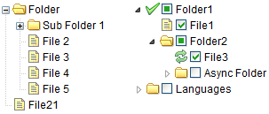
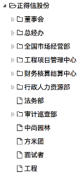

# Tree控件

Tree控件扩展自[`EasyUI Tree`](http://www.jeasyui.com/demo/main/index.php?plugin=tree)

!> [演示](demo/jx-tree.html)



 
## 标记

```html
<div class="jxtree" data-url="../../demo/api/tree1.json"></div>
```

## 节点

每个节点都具备以下属性：

- id：节点ID，对加载远程数据很重要。
- text：显示节点文本。
- state：节点状态，'open' 或 'closed'，默认：'open'。如果为'closed'的时候，将不自动展开该节点。
- checked：表示该节点是否被选中。
- attributes: 被添加到节点的自定义属性。
- children: 一个节点数组声明了若干节点。

## 选项

| **属性名**       | **属性值类型**                     | **描述**                             | **默认值**     |
| :------------ | :---------------------------- | :--------------------------------------- | :---------- |
| url           | string                        | `data`检索远程数据的URL地址。                            | null        |
| method        | string                        | `data`检索数据的HTTP方法。（POST / GET）                 | post        |
| animate       | boolean                       | `data`定义节点在展开或折叠的时候是否显示动画效果。                   | false       |
| checkbox      | boolean                       | `data`定义是否在每一个借点之前都显示复选框。                      | false       |
| cascadeCheck  | boolean                       | `data`定义是否层叠选中状态。                              | true        |
| onlyLeafCheck | boolean                       | `data`定义是否只在末级节点之前显示复选框。                       | false       |
| lines         | boolean                       | `data`定义是否显示树控件上的虚线。                           | false       |
| dnd           | boolean                       | `data`定义是否启用拖拽功能。                              | false       |
| data          | array                         | `data`节点数据加载。 | null        |
| queryParams   | object                        | `data`在请求远程数据的时候增加查询参数并发送到服务器。**（该属性自1.4版开始可用）** | {}          |
| formatter     | function(node)                | 定义如何渲染节点的文本。 | false       |
| loader        | function(param,success,error) | 定义如何从远程服务器加载数据。返回false可以忽略本操作。该函数具备以下参数：param：发送到远程服务器的参数对象。success(data)：当检索数据成功的时候调用的回调函数。error()：当检索数据失败的时候调用的回调函数。 | json loader |
| loadFilter    | function(data,parent)         | 返回过滤过的数据进行展示。返回数据是标准树格式。该函数具备以下参数：data：加载的原始数据。parent: DOM对象，代表父节点。 |       |
| filterBox           | jQuery                  | `data`**(扩展)** 过滤文本框(jQuery对象)。                  | null               |
| loadEmptyMessage    | string                  | `data`**(扩展)** 数据加载为空时显示的消息。                  | 加载的结果为空        |
| filterEmptyMessage  | string                  | `data`**(扩展)** 数据过滤后结果为空时显示的消息。             | 未找到符合条件的结果   |
| clickToggle         | boolean                 | `data`**(扩展)** 单击节点切换展开状态。                     | true                 |
| maskTarget          | jQuery                  | `data`**(扩展)** 加载提示层目标对象。                           | null                 |
| maskMsg             | string                  | `data`**(扩展)** 加载提示层消息。                            | 正在加载,请稍等...     |
| maskDelay           | number                  | `data`**(扩展)** 加载提示层延迟毫秒。                         | 100                 |

   - `data`
   ```js
   $('#tt').jxtree({
       data: [{
           text: 'Item1',
           state: 'closed',
           children: [{
               text: 'Item11'
           }, {
               text: 'Item12'
           }]
       }, {
           text: 'Item2'
       }]
   });
   ```
   
   - `formatter`
   ```js
    $('#tt').jxtree({
        formatter:function(node){
            return node.text;
        }
    });

    $('#tt').jxtree({
        formatter:function(node){
            var s = node.text;
            if (node.children){
                s += ' <span style=\'color:blue\'>(' + node.children.length + ')</span>';
            }
            return s;
        }
    });
   ```

## 事件

很多事件的回调函数都包含'node'参数，其具备如下属性：

- id：绑定节点的标识值。
- text：显示的节点文本。
- iconCls：显示的节点图标CSS类ID。
- checked：该节点是否被选中。
- state：节点状态，'open' 或 'closed'。
- attributes：绑定该节点的自定义属性。
- target：目标DOM对象。

使用方法：

```js
$('#tt').jxtree({
    onClick: function(node){
        // 在用户点击的时候提示
    },
    onCheck:function(node,checked) {
        // 在用户点击勾选复选框的时候触发
    }
});
```

| **事件名**          | **事件参数**              | **描述**                                   |      |
| ---------------- | --------------------- | ---------------------------------------- | ---- |
| onClick          | node                  | 在用户点击一个节点的时候触发。 |      |
| onDblClick       | node                  | 在用户双击一个节点的时候触发。                          |      |
| onBeforeLoad     | node, param           | 在请求加载远程数据之前触发，返回false可以取消加载操作。           |      |
| onLoadSuccess    | node, data            | 在数据加载成功以后触发。                             |      |
| onLoadError      | arguments             | 在数据加载失败的时候触发，arguments参数和jQuery的$.ajax()函数里面的'error'回调函数的参数相同。 |      |
| onBeforeExpand   | node                  | 在节点展开之前触发，返回false可以取消展开操作。               |      |
| onExpand         | node                  | 在节点展开的时候触发。                              |      |
| onBeforeCollapse | node                  | 在节点折叠之前触发，返回false可以取消折叠操作。               |      |
| onCollapse       | node                  | 在节点折叠的时候触发。                              |      |
| onBeforeCheck    | node, checked         | 在用户点击勾选复选框之前触发，返回false可以取消选择动作。**（该事件自1.3.1版开始可用）** |      |
| onCheck          | node, checked         | 在用户点击勾选复选框的时候触发。                         |      |
| onBeforeSelect   | node                  | 在用户选择一个节点之前触发，返回false可以取消选择动作。           |      |
| onSelect         | node                  | 在用户选择节点的时候触发。                            |      |
| onContextMenu    | e, node               | 在右键点击节点的时候触发。 |      |
| onBeforeDrag     | node                  | 在开始拖动节点之前触发，返回false可以拒绝拖动。**（该事件自1.3.2版开始可用）** |      |
| onStartDrag      | node                  | 在开始拖动节点的时候触发。**（该事件自1.3.2版开始可用）**        |      |
| onStopDrag       | node                  | 在停止拖动节点的时候触发。**（该事件自1.3.2版开始可用）**        |      |
| onDragEnter      | target, source        | 在拖动一个节点进入到某个目标节点并释放的时候触发，返回false可以拒绝拖动。target：释放的目标节点元素。source：开始拖动的源节点。**（该事件自1.3.2版开始可用）** |      |
| onDragOver       | target, source        | 在拖动一个节点经过某个目标节点并释放的时候触发，返回false可以拒绝拖动。target：释放的目标节点元素。source：开始拖动的源节点。**（该事件自1.3.2版开始可用）** |      |
| onDragLeave      | target, source        | 在拖动一个节点离开某个目标节点并释放的时候触发，返回false可以拒绝拖动。target：释放的目标节点元素。source：开始拖动的源节点。**（该事件自1.3.2版开始可用）** |      |
| onBeforeDrop     | target, source, point | 在拖动一个节点之前触发，返回false可以拒绝拖动。target：释放的目标节点元素。source：开始拖动的源节点。point：表示哪一种拖动操作，可用值有：'append','top' 或 'bottom'。**（该事件自1.3.3版开始可用）** |      |
| onDrop           | target, source, point | 当节点位置被拖动时触发。target：DOM对象，需要被拖动动的目标节点。source：源节点。point：表示哪一种拖动操作，可用值有：'append','top' 或 'bottom'。 |      |
| onBeforeEdit     | node                  | 在编辑节点之前触发。                               |      |
| onAfterEdit      | node                  | 在编辑节点之后触发。                               |      |
| onCancelEdit     | node                  | 在取消编辑操作的时候触发。                            |      |
  
  - `onClick`
  ```js
    $('#tt').jxtree({
      onClick: function(node){
          alert(node.text);  // 在用户点击的时候提示
      }
    });
  ```
  
  - `onContextMenu`
  ```js
  // 右键点击节点并显示快捷菜单
  $('#tt').jxtree({
  	onContextMenu: function(e, node){
  		e.preventDefault();
  		// 查找节点
  		$('#tt').jxtree('select', node.target);
  		// 显示快捷菜单
  		$('#mm').menu('show', {
  			left: e.pageX,
  			top: e.pageY
  		});
  	}
  });
  ```
  ```html
  <!--右键菜单定义如下：-->
  <div id="mm" class="easyui-menu" style="width:120px;">
      <div onclick="append()" data-options="iconCls:'icon-add'">追加</div>
      <div onclick="remove()" data-options="iconCls:'icon-remove'">移除</div>
  </div>
  ```
  
## 方法

使用方法

```js
$('.jxtree').jxtree('方法名称', arg1, arg2);
```

| **方法名**     | **方法参数** | **描述**                                   |
| ----------- | -------- | ---------------------------------------- |
| options     | none     | 返回树控件属性。                                 |
| loadData    | data     | 读取树控件数据。                                 |
| getNode     | target   | 获取指定节点对象。                                |
| getData     | target   | 获取指定节点数据，包含它的子节点。                        |
| reload      | target   | 重新载入树控件数据。                               |
| getRoot     | nodeEl   | 获取通过“nodeEl”参数指定的节点的顶部父节点元素。**（该方法自1.4版开始可用）** |
| getRoots    | none     | 获取所有根节点，返回节点数组。                          |
| getParent   | target   | 获取父节点，'target'参数代表节点的DOM对象。              |
| getChildren | target   | 获取所有子节点，'target'参数代表节点的DOM对象。            |
| getChecked  | state    | 获取所有选中的节点。'state'可用值有：'checked','unchecked','indeterminate'。如果'state'未指定，将返回'checked'节点。 |
| getSelected | none     | 获取选择节点并返回它，如果未选择则返回null。                 |
| isLeaf      | target   | 判断指定的节点是否是叶子节点，target参数是一个节点DOM对象。       |
| find        | id       | 查找指定节点并返回节点对象。|
| select      | target   | 选择一个节点，'target'参数表示节点的DOM对象。             |
| check       | target   | 选中指定节点。                                  |
| uncheck     | target   | 取消选中指定节点。                                |
| collapse    | target   | 折叠一个节点，'target'参数表示节点的DOM对象。             |
| expand      | target   | 展开一个节点，'target'参数表示节点的DOM对象。在节点关闭或没有子节点的时候，节点ID的值(名为'id'的参数)将会发送给服务器请求子节点的数据。 |
| collapseAll | target   | 折叠所有节点。                                  |
| expandAll   | target   | 展开所有节点。                                  |
| expandTo    | target   | 打开从根节点到指定节点之间的所有节点。                      |
| scrollTo    | target   | 滚动到指定节点。**（该方法自1.3.4版开始可用）**             |
| append      | param    | 追加若干子节点到一个父节点，param参数有2个属性：parent：DOM对象，将要被追加子节点的父节点，如果未指定，子节点将被追加至根节点。data：数组，节点数据。  |
| toggle      | target   | 打开或关闭节点的触发器，target参数是一个节点DOM对象。          |
| insert      | param    | 在一个指定节点之前或之后插入节点，'param'参数包含如下属性：before：DOM对象，在某个节点之前插入。after：DOM对象，在某个节点之后插入。data：对象，节点数据。  |
| remove      | target   | 移除一个节点和它的子节点，'target'参数是该节点的DOM对象。       |
| pop         | target   | 移除一个节点和它的子节点，该方法跟remove方法一样，不同的是它将返回被移除的节点数据。 |
| update      | param    | 更新指定节点。'param'参数包含以下属性：target(DOM对象，将被更新的目标节点)，id，text，iconCls，checked等。 |
| enableDnd   | none     | 启用拖拽功能。                                  |
| disableDnd  | none     | 禁用拖拽功能。                                  |
| beginEdit   | target   | 开始编辑一个节点。                                |
| endEdit     | target   | 结束编辑一个节点。                                |
| cancelEdit  | target   | 取消编辑一个节点。                                |
| getIdByLevel                      |  level                    | **(扩展)** 根据级别获取节点Id。  |
| getPath                           |  id                       | **(扩展)** 获取指定节点的排序路径。  |
| getIndex                          |  id, nodes(节点集合)       | **(扩展)** 获取节点序号。  |
| expandRoot                        | none                      | **(扩展)** 展开根节点。  |
| delayFilter                       | val, delayTime, callback  | **(扩展)** 指定延迟时间进行本地过滤。  |
| clearSelectedOrChecked            | none                      | **(扩展)** 清除节点选中节点或者复选框。  |
| selectedOrCheckedNode             |  val, separator           | **(扩展)** 选中节点或者复选框。  |
| getSelectedOrCheckedData          |  separator                | **(扩展)** 获取节选中点或者复选框值。  |
| scrollToSelectedOrCheckedNode     |  none                     | **(扩展)** 滚动到选中节点或者复选节点。  |


  - `getChecked`
    ```js
    var nodes = $('#tt').jxtree('getChecked');	// get checked nodes
    var nodes = $('#tt').jxtree('getChecked', 'unchecked');	// 获取未选择节点
    var nodes = $('#tt').jxtree('getChecked', 'indeterminate');	// 获取不确定的节点
    
    //译者注：（1.3.4新增获取方式）
    
    var nodes = $('#tt').jxtree('getChecked', ['unchecked','indeterminate']);
    ```
  - `find`
    ```js
    // 查找一个节点并选择它
    var node = $('#tt').jxtree('find', 12);
    $('#tt').jxtree('select', node.target);
    ```  
  - `append`
    ```js
    // 追加若干个节点并选中他们
    var selected = $('#tt').jxtree('getSelected');
    $('#tt').jxtree('append', {
        parent: selected.target,
        data: [{
            id: 23,
            text: 'node23'
        },{
            text: 'node24',
            state: 'closed',
            children: [{
                text: 'node241'
            },{
                text: 'node242'
            }]
        }]
    });
    ```  
  - `insert`
    ```js
    var node = $('#tt').jxtree('getSelected');
    if (node){
        $('#tt').jxtree('insert', {
            before: node.target,
            data: {
                id: 21,
                text: 'node text'
            }
        });
    }
    //译者注：（1.3.4新增获取方式）
    var node = $('#tt').jxtree('getSelected');
    if (node){
        $('#tt').jxtree('insert', {
            before: node.target,
            data: [{
                id: 23,
                text: 'node23'
                        },{
                    text: 'node24',
                            state: 'closed',
                children: [{
                text: 'node241'
                },{
                text: 'node242'
                }]
            }]
        });
    }
    ```  
  - `update`
    ```js
    // 更新选择的节点文本
    var node = $('#tt').jxtree('getSelected');
    if (node){
        $('#tt').jxtree('update', {
            target: node.target,
            text: 'new text'
        });
    }
    ``` 
  - `getSelectedOrCheckedData`
  ```js
  $('.jxtree').jxtree('getSelectedOrCheckedData');
  //单选时返回：{text: "刘三", value: "user_100109"}
  //多选时返回：{text: "中尚科技,方米团,面试者", value: "dept_100057,user_100118,user_100120"}
  ``` 
  - `selectedOrCheckedNode`
  ```js
  $('.jxtree').jxtree('selectedOrCheckedNode','dept_100057,user_100118,user_100120',',');
  //单选时输入：user_100118
  //多选时输入：dept_100057,user_100118,user_100120
  ``` 
    

## 异步加载

树控件内建异步加载模式的支持，用户先创建一个空的树，然后指定一个服务器端，执行检索后动态返回JSON数据来填充树并完成异步请求。例子如下：

```html
<ul class="easyui-tree" data-options="url:'get_data.php'"></ul>  
```
树控件读取URL。子节点的加载依赖于父节点的状态。当展开一个封闭的节点，如果节点没有加载子节点，它将会把节点id的值作为http请求参数并命名为'id'，通过URL发送到服务器上面检索子节点。

下面是从服务器端返回的数据。
```js
[{   
    "id": 1,   
    "text": "Node 1",   
    "state": "closed",   
    "children": [{   
        "id": 11,   
        "text": "Node 11"  
    },{   
        "id": 12,   
        "text": "Node 12"  
    }]   
},{   
    "id": 2,   
    "text": "Node 2",   
    "state": "closed"  
}]  
``` 

节点1和节点2是封闭的，当展开节点1的时候将直接显示它的子节点。当展开节点2的时候它将发送值(2)到服务器获取子节点。
